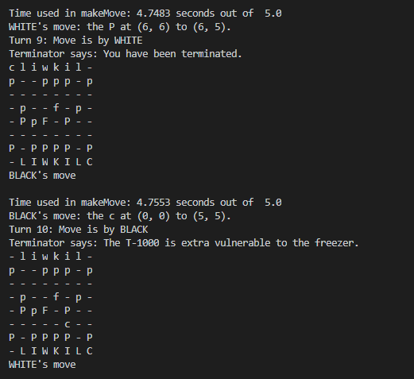

# Baroque Chess AI

This is a collaborative project between me and another student.  We developed a bot for playing Baroque Chess, which is basically Chess with much crazier pieces and rules (general rules can be seen on [Wikipedia](https://en.wikipedia.org/wiki/Baroque_chess)).  The main code for the bot is in `terminator_BC_Player.py`, which uses the minimax search algorithm with alpha-beta pruning for finding the most optimal move given a board state.  Zobrist hashing is also implemented, which helped reduce the search time by at least 30%.  

# Running the code

`BaroqueGameMaster.py` is used to conducted a game between two bots.  To run this, use the template:

```
python3 agentA agentB time_limit
```

An example would be:

```
python3 BaroqueGameMaster.py terminator_BC_Player terminator_BC_Player 5
```

Running this starts printing a game in the terminal between two bots where each move needs to be made within 5 seconds.

Here is a screenshot of an example game session:

